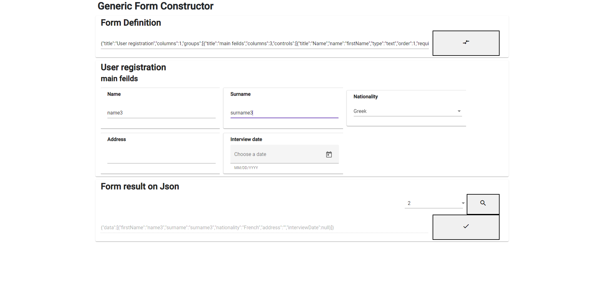

# The GenericFormConstructor
A Web Application to create a form and fill it with values. Also, you can export the result on a JSON object.

Using this Web Application you can create a custom form and fill it and in the end, you also can get the result of that form in JSON object exported in string, and also you can see the previous results.

## JSON Definition 
[JSON Definition] how to can Create Yor own form to use that app

## Test Cases
[Sample-1] And JSON for that Form [Sample 1 JSON]

[Sample-2] And JSON for that Form [Sample 2 JSON]

## How to Build it
Open the project using Microsoft Visual Studio and build the app on DEBUG mode using the `GenericFormConstructor` profile. This preconfigured profile builds the [.Net Core 6] app and the [Angular] app on your localhost and on ports:
* 7215 for the [.Net Core 6] app 
* 44470 for the [Angular] app

## Functionality 
After a successful build, the Browser will pop-up and you will see a loading page from [SPA proxy]. SPA proxy will redirect calls from the [Angular] app to the [.Net Core 6] app and back.

The [Angular] app wil be responsible to create the view for the WebApplication and the functionality on that page. The [.Net Core 6] app wil be responsible to serve that [Angular] app to the specified path. SPA Proxy will handle the communication between the [.Net Core 6] app and the [Angular] app.

## UI Screenshots

## Created With 
- [AngularJS] For designing the WebApp 
- [TypeScript] Utilised by AngularJS 
- [Bootstrap] Used to do the  WebApp responsive
- [Material] Frontend Framework Components 
- [.Net Core 6] for the back end of the WebApp
- [SPA proxy] to redirect HTTP calls through the applications

[Angular]: <https://angular.io/>
[AngularJS]: <http://angularjs.org>
[.Net Core 6]: <https://docs.microsoft.com/el-gr/dotnet/>
[TypeScript]: <https://www.typescriptlang.org/>
[Bootstrap]: <https://getbootstrap.com/>
[Material]: <https://material.angular.io/>
[SPA proxy]: <https://docs.microsoft.com/en-us/archive/msdn-magazine/2013/november/asp-net-single-page-applications-build-modern-responsive-web-apps-with-asp-net>
[JSON Definition]: <https://github.com/NikolasPapas/GenericFormConstructor/blob/main/JSON_Definition.txt>
[Sample-1]: <https://github.com/NikolasPapas/GenericFormConstructor/blob/main/TestCases/Test_JSON_Sample1.pdf>
[Sample 1 JSON]: <https://github.com/NikolasPapas/GenericFormConstructor/blob/main/TestCases/Test_JSON_Sample1.txt>
[Sample-2]: <https://github.com/NikolasPapas/GenericFormConstructor/blob/main/TestCases/Test_JSON_Sample2.pdf>
[Sample 2 JSON]: <https://github.com/NikolasPapas/GenericFormConstructor/blob/main/TestCases/Test_JSON_Sample2.txt>